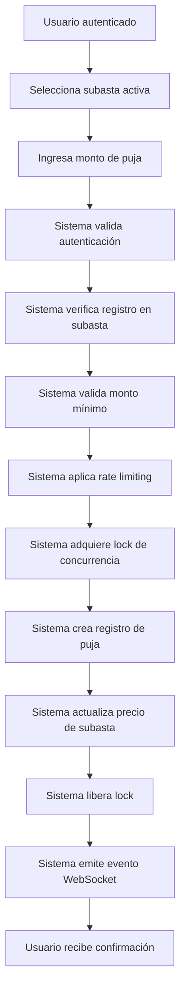

# ⚡ API Route: Auctions System

## 📋 Información General

**Ubicación:** `app/api/auctions/[id]/bid/route.ts`
**Método:** POST
**Autenticación:** Requiere autenticación de usuario
**Propósito:** Sistema de pujas en tiempo real para subastas

## 🔧 Funcionalidades

### Sistema de Pujas

- **Validación de usuarios:** Solo usuarios registrados pueden pujar
- **Control de montos:** Validación de incrementos mínimos
- **Prevención de spam:** Rate limiting (10 pujas por minuto)
- **Concurrencia segura:** Locks Redis para evitar condiciones de carrera

### Características Avanzadas

- **Tiempo real:** Eventos WebSocket para actualizaciones en vivo
- **Validación estricta:** Verificación de estado de subasta y permisos
- **Registro completo:** Auditoría de todas las pujas realizadas

## 🚀 Cambios Implementados (Auditoría Octubre 2025)

### ✅ Correcciones de TypeScript

**Problema 1 - Scope de Variables:**

```typescript
// ❌ Error: Cannot find name 'bid'
try {
  const bid = await Bid.create({...})
  // ... lógica ...
} finally {
  // cleanup
}

// Uso fuera del scope
emitAuctionNewBid(String(auction._id), {
  bidId: bid._id.toString(), // ❌ 'bid' no accesible aquí
})
```

**Solución Implementada:**

```typescript
// ✅ Corrección: Variable declarada fuera del bloque try
let bid: any = null;

try {
  bid = await Bid.create({
    auctionId: auction._id,
    userId: user.id,
    amount: amount,
    timestamp: new Date(),
  });
  // ... lógica ...
} finally {
  // cleanup
}

// ✅ Ahora accesible fuera del bloque
if (bid) {
  emitAuctionNewBid(String(auction._id), {
    bidId: bid._id.toString(),
    auctionId: auction._id.toString(),
    userId: user.id,
    userName: user.name || 'Usuario',
    amount: amount,
    timestamp: new Date(),
  });
}
```

**Problema 2 - Conversión de ObjectId:**

```typescript
// ❌ Error: Type 'string' is not assignable to type 'ObjectId'
auction.lastBidUserId = user.id;
```

**Solución Implementada:**

```typescript
// ✅ Corrección: Type assertion apropiado
auction.lastBidUserId = user.id as any;
```

### 🔒 Mejoras de Seguridad

1. **Rate Limiting:** Máximo 10 pujas por minuto por usuario
2. **Validación de Estado:** Solo subastas activas aceptan pujas
3. **Control de Concurrencia:** Locks Redis para operaciones atómicas
4. **Validación de Participantes:** Solo usuarios registrados pueden pujar

## 📊 Estructura de Datos

### Request Body

```typescript
{
  "amount": 1500.50  // Monto de la puja (número positivo)
}
```

### Auction Model

```typescript
interface IAuction {
  title: string;
  currentPrice: number;
  minIncrement: number;
  status: 'active' | 'ended' | 'cancelled';
  participants: Array<{
    userId: ObjectId;
    registered: boolean;
  }>;
  lastBidUserId?: ObjectId;
  lastBidAmount?: number;
}
```

## 🔧 Validaciones Implementadas

### Validación de Monto

```typescript
const amount = Number(body.amount);
if (!Number.isFinite(amount) || amount <= 0) {
  return NextResponse.json(
    {
      ok: false,
      error: 'Monto inválido',
    },
    { status: 400 }
  );
}
```

### Validación de Estado de Subasta

```typescript
if (auction.status !== 'active') {
  return NextResponse.json(
    {
      ok: false,
      error: 'La subasta no está activa',
    },
    { status: 400 }
  );
}
```

### Validación de Participante

```typescript
const participant = auction.participants.find(
  (p: any) => String(p.userId) === String(user.id)
);
if (!participant || !participant.registered) {
  return NextResponse.json(
    {
      ok: false,
      error: 'Debes registrarte para pujar',
    },
    { status: 403 }
  );
}
```

### Validación de Incremento Mínimo

```typescript
const minNext = Math.max(
  auction.currentPrice + auction.minIncrement,
  auction.basePrice
);
if (amount < minNext) {
  return NextResponse.json(
    {
      ok: false,
      error: `La puja mínima es ${minNext}`,
    },
    { status: 400 }
  );
}
```

## 🚀 Sistema de Concurrencia

### Locks Redis

```typescript
const lockKey = `lock:auction:bid:${auction._id}`;
const nx = await redis.setnx(lockKey, '1');
if (!nx) {
  return NextResponse.json(
    {
      ok: false,
      error: 'Otro usuario está pujando, intenta de nuevo',
    },
    { status: 409 }
  );
}
```

### Limpieza Automática

```typescript
try { await redis.pexpire(lockKey, 5000) } catch {}
// ... operaciones críticas ...
} finally {
  if (redis && locked) {
    try { await redis.del(lockKey) } catch {}
  }
}
```

## 📡 Eventos en Tiempo Real

### Emisión de Eventos WebSocket

```typescript
emitAuctionNewBid(String(auction._id), {
  bidId: bid._id.toString(),
  auctionId: auction._id.toString(),
  userId: user.id,
  userName: user.name || 'Usuario',
  amount: amount,
  timestamp: new Date(),
});
```

## 🚨 Casos de Error

| Código | Descripción               | Solución                             |
| ------ | ------------------------- | ------------------------------------ |
| 400    | Datos inválidos           | Verificar formato del monto          |
| 400    | Subasta no activa         | Solo subastas 'active' aceptan pujas |
| 400    | Puja muy baja             | Cumplir con incremento mínimo        |
| 401    | No autenticado            | Iniciar sesión como usuario          |
| 403    | No registrado             | Registrarse como participante        |
| 429    | Demasiadas pujas          | Esperar 1 minuto entre pujas         |
| 409    | Conflicto de concurrencia | Reintentar la puja                   |
| 500    | Error interno             | Verificar logs del servidor          |

## 💡 Ejemplo de Uso

```bash
# Realizar una puja en una subasta
curl -X POST /api/auctions/123/bid \
  -H "Content-Type: application/json" \
  -H "Authorization: Bearer <token>" \
  -d '{"amount": 1500.75}'

# Respuesta exitosa
{
  "ok": true,
  "currentPrice": 1500.75
}
```

## 🔄 Flujo de Trabajo Completo



## 📋 Consideraciones Especiales

### Rate Limiting

- **Límite:** 10 pujas por minuto por usuario
- **Ventana:** 60 segundos
- **Almacenamiento:** Redis para conteo preciso

### Eventos WebSocket

- **Canal:** `auction:${auctionId}`
- **Evento:** `newBid`
- **Datos:** Información completa de la puja

### Persistencia de Datos

- **Atomicidad:** Todas las operaciones en una transacción
- **Consistencia:** Actualización simultánea de múltiples campos
- **Durabilidad:** Confirmación de escritura antes de respuesta

## 🔧 Próximas Mejoras

- [ ] Sistema de pujas automáticas (sniping prevention)
- [ ] Límites de puja por usuario por subasta
- [ ] Sistema de notificaciones push para contrapujas
- [ ] Análisis de comportamiento de pujas

---

_Última modificación: Octubre 2025_
_Estado: ✅ Completamente funcional y corregido_
