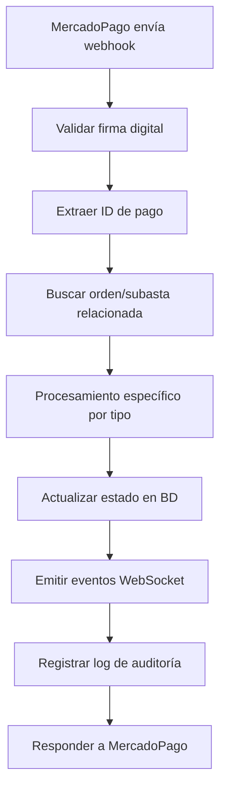

# 💳 API Route: MercadoPago Integration

## 📋 Información General

**Ubicación:** `app/api/mercadopago/webhook/route.ts`
**Métodos:** GET, POST
**Autenticación:** Firma digital de MercadoPago
**Propósito:** Procesamiento de webhooks de pagos de MercadoPago

## 🔧 Funcionalidades

### Procesamiento de Webhooks

- **Validación de firmas:** Verificación de autenticidad de MercadoPago
- **Procesamiento de pagos:** Manejo de diferentes estados de pago
- **Gestión de subastas:** Procesamiento específico para pagos de subastas
- **Gestión de órdenes:** Procesamiento estándar para pedidos regulares

### Estados de Pago Soportados

- `approved` → `paid`
- `pending` → `pending_payment`
- `in_process` → `pending_payment`
- `authorized` → `pending_payment`
- `in_mediation` → `failed`
- `rejected` → `failed`
- `cancelled` → `cancelled`
- `refunded` → `cancelled`
- `charged_back` → `cancelled`

## 🚀 Cambios Implementados (Auditoría Octubre 2025)

### ✅ Correcciones de TypeScript

**Problema Original:**

```typescript
// ❌ Error: Type 'string' not assignable to union type
auction.paymentStatus = statusMap[payment.status] || 'pending_payment';

// statusMap devolvía string pero esperaba tipo específico
const statusMap: Record<string, string> = {
  approved: 'paid',
  in_mediation: 'in_dispute', // ❌ No válido para auction.paymentStatus
  rejected: 'payment_failed', // ❌ No válido para auction.paymentStatus
  refunded: 'refunded', // ❌ No válido para auction.paymentStatus
};
```

**Solución Implementada:**

```typescript
// ✅ Corrección: Mapeo correcto a tipos válidos
const statusMap: Record<
  string,
  'pending_payment' | 'paid' | 'failed' | 'cancelled'
> = {
  approved: 'paid',
  pending: 'pending_payment',
  in_process: 'pending_payment',
  authorized: 'pending_payment',
  in_mediation: 'failed', // ✅ Mapeado correctamente
  rejected: 'failed', // ✅ Mapeado correctamente
  cancelled: 'cancelled', // ✅ Mapeado correctamente
  refunded: 'cancelled', // ✅ Mapeado correctamente
  charged_back: 'cancelled', // ✅ Mapeado correctamente
};

auction.paymentStatus = statusMap[payment.status] || 'pending_payment';
```

### 🔒 Mejoras de Seguridad

1. **Validación de Firmas:** Verificación estricta de webhooks de MercadoPago
2. **Procesamiento Seguro:** Manejo seguro de datos sensibles de pago
3. **Idempotencia:** Prevención de procesamiento duplicado

## 📊 Estructura de Webhook

### Payload de MercadoPago

```typescript
{
  "id": "payment_id",
  "type": "payment",
  "data": {
    "id": "payment_id"
  },
  "date_created": "2025-01-01T00:00:00Z",
  "user_id": "user_id",
  "api_version": "v1"
}
```

### Headers de Seguridad

```typescript
{
  "x-signature": "firma_digital",
  "x-request-id": "request_id",
  "content-type": "application/json"
}
```

## 🔧 Procesamiento de Pagos

### Función Principal de Webhook

```typescript
export async function POST(request: NextRequest) {
  // 1. Validación de firma digital
  // 2. Extracción de ID de pago
  // 3. Procesamiento según tipo
  // 4. Respuesta HTTP apropiada
}
```

### Validación de Firma

```typescript
const xSignature = request.headers.get('x-signature') || '';
const xRequestId = request.headers.get('x-request-id') || '';
const dataId = body?.data?.id || body?.resource?.split('/').pop() || '';

const isValid = validateMpWebhookSignature(
  xSignature,
  xRequestId,
  dataId,
  secret
);
if (!isValid) {
  return NextResponse.json({ error: 'Invalid signature' }, { status: 401 });
}
```

## 🚀 Procesamiento Especializado

### Subastas Pagadas

```typescript
if (auction) {
  // Procesamiento específico para subastas
  const auctionPayLockKey = `AUC_FINAL:${auctionId}:${payment.id}:${payment.status}`;
  const gotAuctionPayLock = await acquireLock(auctionPayLockKey);

  if (gotAuctionPayLock) {
    // Crear orden derivada automáticamente
    await createDerivedOrder(auction, payment);
  }
}
```

### Órdenes Regulares

```typescript
// Procesamiento estándar para pedidos
const orderQuery = {
  $or: [
    { mercadoPagoId: payment.id },
    { 'paymentDetails.mercadoPagoId': payment.id },
  ],
};

let order = await Order.findOne(orderQuery);
if (order) {
  await processOrderPayment(order, payment);
}
```

## 📡 Eventos WebSocket

### Notificaciones en Tiempo Real

```typescript
// Notificar al cliente
io.to(`user:${order.customer}`).emit('order:updated', eventData);

// Notificar a administradores
io.to('admin:orders').emit('order:payment:updated', eventData);
```

## 🚨 Casos de Error

| Código | Descripción                | Solución                                          |
| ------ | -------------------------- | ------------------------------------------------- |
| 401    | Firma inválida             | Verificar configuración de webhook en MercadoPago |
| 404    | Orden no encontrada        | Verificar referencia externa del pago             |
| 409    | Conflicto de procesamiento | Reintentar automáticamente                        |
| 500    | Error interno              | Verificar logs detallados                         |

## 💡 Ejemplo de Uso

### Webhook de Pago Aprobado

```json
{
  "type": "payment",
  "data": {
    "id": "123456789"
  },
  "status": "approved",
  "external_reference": "AUC_auction_id"
}
```

### Procesamiento Interno

1. Validar firma del webhook
2. Buscar orden/subasta relacionada
3. Actualizar estado de pago
4. Procesar lógica de negocio específica
5. Emitir eventos WebSocket
6. Registrar log de auditoría

## 🔄 Flujo de Procesamiento



## 📋 Configuración de MercadoPago

### Variables de Entorno

```bash
MERCADOPAGO_ACCESS_TOKEN=your_access_token
MERCADOPAGO_WEBHOOK_SECRET=your_webhook_secret
MP_APPLICATION_ID=your_application_id
```

### URLs de Webhook

```
Producción: https://yourdomain.com/api/mercadopago/webhook
Desarrollo: http://localhost:3000/api/mercadopago/webhook
```

## 🔧 Próximas Mejoras

- [ ] Reintentos automáticos para pagos fallidos
- [ ] Sistema de alertas para pagos sospechosos
- [ ] Dashboard de métricas de pagos por período
- [ ] Integración con sistemas antifraude

---

_Última modificación: Octubre 2025_
_Estado: ✅ Completamente funcional y corregido_
