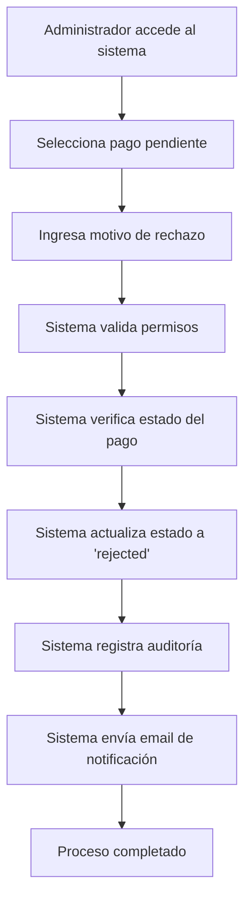

# 💰 API Route: Payouts Management System

## 📋 Información General

**Ubicación:** `app/api/admin/payouts/[id]/reject/route.ts`
**Método:** POST
**Autenticación:** Requiere sesión de administrador
**Propósito:** Rechazo de solicitudes de pago de proveedores

## 🔧 Funcionalidades

### Proceso de Rechazo de Pagos

- **Validación de permisos:** Solo administradores pueden rechazar pagos
- **Verificación de estado:** Solo pagos pendientes pueden ser rechazados
- **Registro de auditoría:** Seguimiento completo del proceso de rechazo
- **Notificaciones:** Sistema de email para informar al proveedor

### Validaciones Implementadas

- **Estado del pago:** Verifica que el pago esté en estado 'pending'
- **Motivo de rechazo:** Campo obligatorio para justificar la decisión
- **Registro de cambios:** Timestamp y usuario que realiza la acción

## 🚀 Cambios Implementados (Auditoría Octubre 2025)

### ✅ Correcciones de TypeScript

**Problema Original:**

```typescript
// Error: Cannot find name 'payoutId'
await sendPayoutRejectionEmail(payout.id, reason);
//                                    ^^^^^^ Variable no definida
```

**Solución Implementada:**

```typescript
// ✅ Corrección: Conversión explícita de ObjectId a string
try {
  await sendPayoutRejectionEmail(payout.id.toString(), reason);
} catch (emailError) {
  console.error('Failed to send rejection email:', emailError);
}
```

### 🔒 Mejoras de Seguridad

1. **Validación estricta:** Verificación de tipos mejorada
2. **Manejo de errores:** Captura y logging de errores de email
3. **Autenticación:** Verificación de sesión de administrador

## 📊 Estructura de Datos

### Request Body

```typescript
{
  "reason": "string" // Motivo obligatorio del rechazo
}
```

### Response Exitosa

```typescript
{
  "message": "Payout rejected successfully"
}
```

### Estados de Pago

```typescript
type PayoutStatus = 'pending' | 'approved' | 'rejected' | 'paid';
```

## 🔒 Seguridad y Validaciones

### Middleware de Autenticación

```typescript
const session = await getServerSession(authOptions);
if (!session?.user?.id || session.user.role !== 'admin') {
  return NextResponse.json({ error: 'Unauthorized' }, { status: 401 });
}
```

### Validaciones de Estado

```typescript
if (payout.status !== 'pending') {
  return NextResponse.json(
    {
      error: 'Payout is not pending',
    },
    { status: 400 }
  );
}
```

## 📧 Sistema de Notificaciones

### Función de Email

```typescript
// lib/email.ts
export const sendPayoutRejectionEmail = async (
  payoutId: string,
  reason: string
) => {
  // Implementación de envío de email con motivo de rechazo
};
```

### Manejo de Errores de Email

```typescript
try {
  await sendPayoutRejectionEmail(payout.id.toString(), reason);
} catch (emailError) {
  console.error('Failed to send rejection email:', emailError);
  // El proceso continúa aunque falle el email
}
```

## 🔄 Flujo de Trabajo



## 🚨 Casos de Error

| Código | Descripción        | Solución                               |
| ------ | ------------------ | -------------------------------------- |
| 401    | No autorizado      | Verificar sesión de administrador      |
| 404    | Pago no encontrado | Verificar ID del pago                  |
| 400    | Pago no pendiente  | Solo pagos 'pending' pueden rechazarse |
| 400    | Motivo requerido   | Proporcionar razón del rechazo         |
| 500    | Error interno      | Verificar logs del servidor            |

## 💡 Ejemplo de Uso

```bash
# Rechazar un pago con motivo
curl -X POST /api/admin/payouts/123/reject \
  -H "Content-Type: application/json" \
  -d '{"reason": "Documentación incompleta"}'
```

## 📋 Campos de Auditoría

### Información Registrada

- **ID del pago:** Identificador único
- **Estado anterior:** 'pending'
- **Estado nuevo:** 'rejected'
- **Usuario que rechaza:** ID del administrador
- **Timestamp:** Fecha y hora del rechazo
- **Motivo:** Razón proporcionada

### Base de Datos

```typescript
{
  status: 'rejected',
  rejectionReason: 'Motivo del rechazo',
  rejectedAt: new Date(),
  rejectedBy: 'admin_user_id'
}
```

## 🔧 Próximas Mejoras

- [ ] Implementar sistema de apelaciones para rechazos
- [ ] Agregar categorías de motivos de rechazo predefinidos
- [ ] Sistema de notificaciones push para proveedores
- [ ] Dashboard de métricas de rechazos por administrador

---

_Última modificación: Octubre 2025_
_Estado: ✅ Completamente funcional y corregido_
