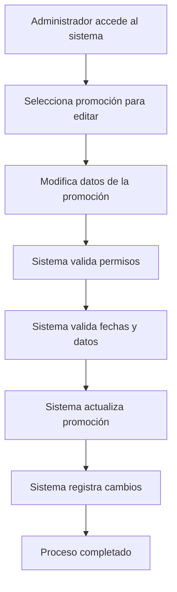

# 🎫 API Route: Promotions Management System

## 📋 Información General

**Ubicación:** `app/api/admin/promotions/[id]/route.ts`
**Métodos:** PATCH, DELETE
**Autenticación:** Requiere rol de administrador
**Propósito:** Gestión completa del sistema de promociones y cupones

## 🔧 Funcionalidades

### Gestión de Promociones

- **Actualización:** Modificación de promociones existentes
- **Eliminación:** Remoción segura de promociones
- **Validación de fechas:** Control de fechas de inicio y fin
- **Control de uso:** Seguimiento de límites de uso

### Tipos de Promoción Soportados

- **Porcentaje:** Descuento basado en porcentaje
- **Monto fijo:** Descuento de cantidad específica
- **Envío gratis:** Eliminación de costos de envío
- **Compra X lleva Y:** Promociones especiales

## 🚀 Cambios Implementados (Auditoría Octubre 2025)

### ✅ Correcciones de TypeScript

**Problema Original:**

```typescript
// Error: Property 'name' does not exist on type 'ObjectId'
createdBy: {
  name: updatedPromotion.createdBy?.name || 'Admin',
  email: updatedPromotion.createdBy?.email || 'N/A'
}
```

**Solución Implementada:**

```typescript
// ✅ Corrección: Interfaces tipadas correctamente
interface PopulatedUser {
  _id: string;
  name: string;
  email: string;
}

interface PromotionWithPopulatedUser {
  // ... otros campos
  createdBy: PopulatedUser;
  // ... resto de campos
}

// Uso correcto
const updatedPromotion = await Promotion.findByIdAndUpdate(
  promotionId,
  updateData,
  { new: true, runValidators: true }
).populate('createdBy', 'name email') as PromotionWithPopulatedUser | null;

createdBy: {
  name: updatedPromotion.createdBy?.name || 'Admin',
  email: updatedPromotion.createdBy?.email || 'N/A'
}
```

### 📋 Mejoras Técnicas

1. **Interfaces Específicas:** Creación de tipos para modelos poblados
2. **Type Safety:** Eliminación de `as any` innecesarios
3. **Validación Robusta:** Mejora en la verificación de datos

## 🔒 Seguridad y Autenticación

### Middleware de Autenticación

```typescript
const { user } = await requireRole(request, [USER_ROLES.ADMIN]);
```

### Validación de Permisos

- Solo usuarios con rol `admin` pueden gestionar promociones
- Validación automática de sesión y permisos

## 📊 Estructura de Datos

### Promotion Model

```typescript
interface IPromotion {
  name: string;
  title: string;
  description: string;
  type: 'percentage' | 'fixed_amount' | 'free_shipping' | 'buy_x_get_y';
  value: number;
  isActive: boolean;
  startDate: Date;
  endDate: Date;
  usageLimit?: number;
  usedCount: number;
  createdBy: ObjectId; // Referencia a User
  // ... otros campos
}
```

### Request Body (PATCH)

```typescript
{
  "name": "string",
  "description": "string",
  "type": "percentage",
  "value": 15,
  "startDate": "2025-01-01T00:00:00Z",
  "endDate": "2025-01-31T23:59:59Z",
  "isActive": true,
  "usageLimit": 100
}
```

## 🔧 Validaciones Implementadas

### Validación de Fechas

```typescript
if (updateData.startDate && updateData.endDate) {
  const startDate = new Date(updateData.startDate);
  const endDate = new Date(updateData.endDate);

  if (startDate >= endDate) {
    return NextResponse.json(
      {
        error: 'La fecha de fin debe ser posterior a la fecha de inicio',
      },
      { status: 400 }
    );
  }
}
```

### Búsqueda y Verificación

```typescript
const promotion = await Promotion.findById(promotionId);
if (!promotion) {
  return NextResponse.json(
    {
      error: 'Promoción no encontrada',
    },
    { status: 404 }
  );
}
```

## 📈 Sistema de Seguimiento

### Información de Usuario

```typescript
createdBy: {
  name: updatedPromotion.createdBy?.name || 'Admin',
  email: updatedPromotion.createdBy?.email || 'N/A'
}
```

### Metadata de Cambios

```typescript
{
  createdAt: updatedPromotion.createdAt,
  updatedAt: updatedPromotion.updatedAt
}
```

## 🚨 Casos de Error

| Código | Descripción             | Solución                                        |
| ------ | ----------------------- | ----------------------------------------------- |
| 400    | Datos inválidos         | Verificar formato de fechas y campos requeridos |
| 401    | No autorizado           | Verificar permisos de administrador             |
| 404    | Promoción no encontrada | Verificar ID de la promoción                    |
| 500    | Error interno           | Verificar logs del servidor                     |

## 💡 Ejemplos de Uso

### Actualizar Promoción

```bash
curl -X PATCH /api/admin/promotions/123 \
  -H "Content-Type: application/json" \
  -d '{
    "name": "Descuento de Verano",
    "description": "15% de descuento en productos de verano",
    "type": "percentage",
    "value": 15,
    "startDate": "2025-01-01T00:00:00Z",
    "endDate": "2025-01-31T23:59:59Z"
  }'
```

### Eliminar Promoción

```bash
curl -X DELETE /api/admin/promotions/123
```

## 🔄 Flujo de Trabajo



## 📋 Consideraciones Especiales

### Manejo de Fechas

- Validación automática de que `endDate > startDate`
- Soporte para zonas horarias
- Validación de formato ISO 8601

### Límites de Uso

- Seguimiento automático de `usedCount`
- Validación contra `usageLimit` cuando aplica
- Actualización en tiempo real

## 🔧 Próximas Mejoras

- [ ] Sistema de códigos QR para promociones
- [ ] Integración con sistemas de email marketing
- [ ] Análisis avanzado de efectividad de promociones
- [ ] Sistema de A/B testing para promociones

---

_Última modificación: Octubre 2025_
_Estado: ✅ Completamente funcional y corregido_
