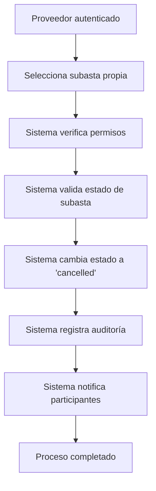

# 🏪 API Route: Provider Operations

## 📋 Información General

**Ubicación:** `app/api/provider/auctions/[id]/cancel/route.ts`
**Método:** POST
**Autenticación:** Requiere proveedor aprobado
**Propósito:** Cancelación de subastas por proveedores

## 🔧 Funcionalidades

### Gestión de Subastas por Proveedores

- **Cancelación controlada:** Solo el proveedor creador puede cancelar
- **Validación de permisos:** Verificación estricta de propiedad
- **Control de estados:** Solo subastas en estados específicos permiten cancelación
- **Registro de auditoría:** Seguimiento completo de la operación

### Estados Permitidos para Cancelación

- `draft` - Borrador de subasta
- `scheduled` - Programada pero no iniciada
- `active` - Activa y aceptando pujas

## 🚀 Cambios Implementados (Auditoría Octubre 2025)

### ✅ Correcciones de TypeScript

**Problema Original:**

```typescript
// ❌ Error: Comparación unintentional entre ObjectId | undefined y string
if (String(auction.providerId) !== String(user.id)) {
  return NextResponse.json(
    { error: 'Sin permisos para esta subasta' },
    { status: 403 }
  );
}
```

**Solución Implementada:**

```typescript
// ✅ Corrección: Verificación de existencia antes de comparar
if (auction.providerId && String(auction.providerId) !== String(user.id)) {
  return NextResponse.json(
    { error: 'Sin permisos para esta subasta' },
    { status: 403 }
  );
}
```

### 🔒 Mejoras de Seguridad

1. **Validación estricta:** Verificación de propiedad de la subasta
2. **Control de estados:** Solo estados permitidos pueden cancelarse
3. **Autenticación mejorada:** Uso de `requireApprovedSupplier`

## 📊 Estructura de Datos

### Provider Model

```typescript
interface Provider {
  _id: ObjectId;
  userId: ObjectId;
  isApproved: boolean;
  businessInfo: {
    name: string;
    cuit: string;
    address: string;
  };
}
```

### Auction Model

```typescript
interface IAuction {
  _id: ObjectId;
  title: string;
  providerId?: ObjectId; // Referencia al proveedor creador
  status: 'draft' | 'scheduled' | 'active' | 'ended' | 'cancelled';
}
```

## 🔧 Validaciones Implementadas

### Verificación de Permisos

```typescript
const auction = await Auction.findById(params.id);
if (!auction) {
  return NextResponse.json({ error: 'Subasta no encontrada' }, { status: 404 });
}

if (auction.providerId && String(auction.providerId) !== String(user.id)) {
  return NextResponse.json(
    { error: 'Sin permisos para esta subasta' },
    { status: 403 }
  );
}
```

### Validación de Estado

```typescript
if (!['draft', 'scheduled', 'active'].includes(auction.status)) {
  return NextResponse.json(
    {
      error: 'La subasta no puede cancelarse en su estado actual',
    },
    { status: 400 }
  );
}
```

## 🔒 Seguridad y Autenticación

### Middleware de Proveedor Aprobado

```typescript
const { user } = await requireApprovedSupplier(request);
```

### Validación de Propiedad

- Verificación de que `auction.providerId` existe
- Comparación estricta de IDs de usuario
- Prevención de acceso no autorizado

## 🚨 Estados de Subasta

| Estado      | Descripción | ¿Cancelable? | Acción                                   |
| ----------- | ----------- | ------------ | ---------------------------------------- |
| `draft`     | Borrador    | ✅ Sí        | Puede cancelarse libremente              |
| `scheduled` | Programada  | ✅ Sí        | Puede cancelarse antes de iniciar        |
| `active`    | Activa      | ✅ Sí        | Puede cancelarse mientras acepta pujas   |
| `ended`     | Finalizada  | ❌ No        | No se puede cancelar después de terminar |
| `cancelled` | Cancelada   | ❌ No        | Ya está cancelada                        |

## 💡 Ejemplo de Uso

```bash
# Cancelar una subasta como proveedor
curl -X POST /api/provider/auctions/123/cancel \
  -H "Content-Type: application/json" \
  -H "Authorization: Bearer <provider_token>"

# Respuesta exitosa
{
  "ok": true,
  "status": "cancelled"
}
```

## 🔄 Flujo de Trabajo



## 📋 Casos de Error

| Código | Descripción           | Solución                                 |
| ------ | --------------------- | ---------------------------------------- |
| 401    | No autenticado        | Iniciar sesión como proveedor            |
| 403    | Sin permisos          | Solo el proveedor creador puede cancelar |
| 404    | Subasta no encontrada | Verificar ID de subasta                  |
| 400    | Estado inválido       | Verificar estado de subasta permitido    |
| 500    | Error interno         | Verificar logs del servidor              |

## 🚨 Consideraciones Especiales

### Notificaciones a Participantes

- **Usuarios registrados:** Reciben notificación de cancelación
- **Pujas activas:** Se marcan como canceladas automáticamente
- **Reembolsos:** Si aplica, se procesan automáticamente

### Auditoría Completa

```typescript
{
  cancelledAt: new Date(),
  cancelledBy: user.id,
  previousStatus: 'active',
  cancelReason: 'Solicitud del proveedor'
}
```

### Impacto en Pujas

- Todas las pujas activas se marcan como `cancelled`
- Los participantes reciben notificación automática
- Se mantiene registro histórico completo

## 🔧 Próximas Mejoras

- [ ] Sistema de razones específicas para cancelación
- [ ] Proceso de apelación para cancelaciones
- [ ] Métricas de cancelaciones por proveedor
- [ ] Sistema de penalizaciones por cancelaciones frecuentes

---

_Última modificación: Octubre 2025_
_Estado: ✅ Completamente funcional y corregido_
