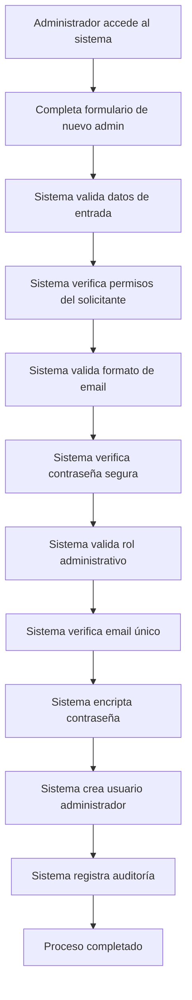

# 👥 API Route: User Management System

## 📋 Información General

**Ubicación:** `app/api/admin/users/create-admin/route.ts`
**Método:** POST
**Autenticación:** Requiere sesión de administrador
**Propósito:** Creación de nuevos usuarios administradores

## 🔧 Funcionalidades

### Creación de Administradores

- **Validación de datos:** Verificación completa de email, nombre y contraseña
- **Encriptación segura:** Hash de contraseñas con bcrypt
- **Control de permisos:** Sistema granular de roles administrativos
- **Prevención de duplicados:** Verificación de emails existentes

### Roles Administrativos Soportados

- `admin` - Administrador completo
- `admin-users` - Gestión de usuarios
- `admin-products` - Gestión de productos
- `admin-orders` - Gestión de pedidos
- `admin-supports` - Soporte al cliente
- `admin-promos` - Gestión de promociones

## 🚀 Cambios Implementados (Auditoría Octubre 2025)

### ✅ Correcciones de TypeScript

**Problema Original:**

```typescript
// Error: Argument of type '{ status: number; }' is not assignable to parameter of type 'string'
return jsonOk(
  {
    message: 'Administrador creado exitosamente',
    admin: {
      /* datos */
    },
  },
  { status: 201 }
); // ❌ Segundo parámetro debe ser string
```

**Solución Implementada:**

```typescript
// ✅ Corrección: Uso correcto de NextResponse.json()
return NextResponse.json(
  {
    message: 'Administrador creado exitosamente',
    admin: {
      id: newAdmin._id,
      email: newAdmin.email,
      name: newAdmin.name,
      phone: newAdmin.phone,
      role: newAdmin.role,
      createdAt: newAdmin.createdAt,
    },
  },
  { status: 201 }
);
```

### 🔒 Mejoras de Seguridad

1. **Validación estricta:** Verificación de formato de email con regex
2. **Requisitos de contraseña:** Mínimo 6 caracteres
3. **Encriptación:** Hash bcrypt con salt de 10 rondas
4. **Control de duplicados:** Verificación de emails existentes

## 📊 Estructura de Datos

### Request Body

```typescript
{
  "email": "admin@example.com",    // Requerido, formato email válido
  "name": "Nombre Administrador",   // Requerido
  "password": "contraseña123",     // Requerido, mínimo 6 caracteres
  "phone": "+5491123456789",       // Opcional
  "role": "admin"                  // Opcional, por defecto "admin"
}
```

### Response Exitosa

```typescript
{
  "message": "Administrador creado exitosamente",
  "admin": {
    "id": "507f1f77bcf86cd799439011",
    "email": "admin@example.com",
    "name": "Nombre Administrador",
    "phone": "+5491123456789",
    "role": "admin",
    "createdAt": "2025-01-01T00:00:00.000Z"
  }
}
```

## 🔧 Validaciones Implementadas

### Validación de Email

```typescript
if (!/^[^\s@]+@[^\s@]+\.[^\s@]+$/.test(email)) {
  return jsonError('Formato de email inválido', 400);
}
```

### Validación de Contraseña

```typescript
if (password.length < 6) {
  return jsonError('La contraseña debe tener al menos 6 caracteres', 400);
}
```

### Validación de Rol

```typescript
const validAdminRoles = [
  'admin',
  'admin-users',
  'admin-products',
  'admin-orders',
  'admin-supports',
  'admin-promos',
];

if (!validAdminRoles.includes(adminRole)) {
  return jsonError('Tipo de administrador inválido', 400);
}
```

### Verificación de Duplicados

```typescript
const existingUser = await User.findOne({ email: email.toLowerCase() });
if (existingUser) {
  return jsonError('El email ya está registrado', 409);
}
```

## 🔒 Seguridad y Autenticación

### Middleware de Autenticación

```typescript
const { user } = await requireRole(request, [USER_ROLES.ADMIN]);
```

### Encriptación de Contraseñas

```typescript
const hashedPassword = await bcrypt.hash(password, 10);
// Almacenamiento seguro de credenciales
```

### Configuración de Usuario Administrador

```typescript
const newAdmin = await User.create({
  email: email.toLowerCase(),
  name: name.trim(),
  phone: phone?.trim() || '',
  password: hashedPassword,
  role: adminRole,
  isActive: true,
  isEmailVerified: true,
  isApproved: true,
  createdBy: user.id,
  createdAt: new Date(),
});
```

## 🚨 Casos de Error

| Código | Descripción      | Solución                                |
| ------ | ---------------- | --------------------------------------- |
| 400    | Datos inválidos  | Verificar formato de email y contraseña |
| 400    | Contraseña débil | Usar mínimo 6 caracteres                |
| 400    | Rol inválido     | Usar roles administrativos válidos      |
| 401    | No autorizado    | Verificar permisos de administrador     |
| 409    | Email duplicado  | Usar email único                        |
| 500    | Error interno    | Verificar logs del servidor             |

## 💡 Ejemplo de Uso

```bash
# Crear administrador básico
curl -X POST /api/admin/users/create-admin \
  -H "Content-Type: application/json" \
  -d '{
    "email": "nuevoadmin@empresa.com",
    "name": "Nuevo Administrador",
    "password": "contraseña123",
    "role": "admin"
  }'

# Crear administrador con permisos específicos
curl -X POST /api/admin/users/create-admin \
  -H "Content-Type: application/json" \
  -d '{
    "email": "gestorproductos@empresa.com",
    "name": "Gestor de Productos",
    "password": "contraseña123",
    "role": "admin-products",
    "phone": "+5491123456789"
  }'
```

## 🔄 Flujo de Trabajo



## 📋 Consideraciones Especiales

### Gestión de Roles

- **Jerarquía clara:** Roles específicos para diferentes responsabilidades
- **Principio de menor privilegio:** Otorgar solo permisos necesarios
- **Auditoría completa:** Seguimiento de quién crea cada administrador

### Seguridad de Contraseñas

- **Hash bcrypt:** Nivel 10 de seguridad recomendado
- **Sin almacenamiento plano:** Nunca se guardan contraseñas en texto claro
- **Longitud mínima:** Política de 6 caracteres mínimos

### Email y Verificación

- **Conversión a minúsculas:** Normalización automática de emails
- **Verificación automática:** Los administradores se crean con email verificado
- **Estado activo:** Los nuevos administradores están activos inmediatamente

## 🔧 Próximas Mejoras

- [ ] Sistema de aprobación para nuevos administradores
- [ ] Notificaciones de bienvenida automáticas
- [ ] Sistema de recuperación de contraseñas para administradores
- [ ] Auditoría avanzada con logs de actividad administrativa

---

_Última modificación: Octubre 2025_
_Estado: ✅ Completamente funcional y corregido_
